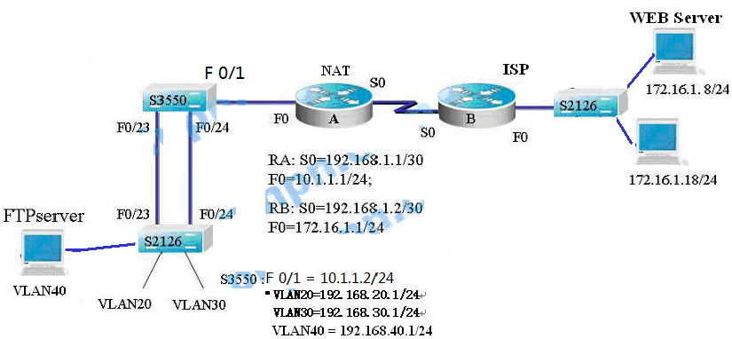
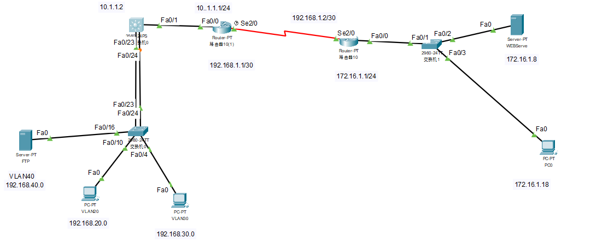

## 二、实验原理与内容

 



实验原理：利用交换机、路由器完成小型计算机网络的搭建，其中涉及到VLAN、ACL、路由、NAT等内容。

实验内容：

1. 按照图1给出的网络拓扑结构，自行搭建网络环境(在模拟器Packet Tracer和真实网络设备中完成)。
2. 在S3550与S2126两台设备中创建VLAN20、VLAN30 、VLAN40。在S2126上，VLAN30包含1－5和7端口，VLAN20包含10－15端口，VLAN40包含16－18端口。
3. 将S3550与S2126两台设备的F0／23与F0／24接口分别配置为TRUNK端口，建立TRUNK链路。

4. 按照图1所给地址为设备配置ip地址。其中，VLAN20内的主机地址块是

   192.168.20.0/24(除掉192.168.20.1/24给虚接口VLAN20用)；VLAN30内的主机地址块是192.168.30.0/24(除掉192.168.30.1/24给虚接口VLAN30用)，VLAN40内的主机地址块是192.168.40.0/24(除掉192.168.40.1/24给虚接口VLAN40用)，则FTP Server的地址也在这段范围内。

5. 给路由器A的S0接口配置clock rate 64000，并运行RIPV2路由协议。

6. 启用三层交换机S3550的路由功能，配置RIPV2路由协议，使得S3550能够为VLAN20、VLAN30、VLAN40转发数据。

7. 在三层交换机S3550配置ACL，禁止办公网VLAN20和员工网VLAN30对服务器FTP server进行访问。

8. 在路由器A上配置NAT技术，使得办公网VLAN20和员工网VLAN30的主机必须使用企业申请的公网地址133.1.1.1/24来访问ISP的WEB Server(172.16.1.8/24)。

9. 在路由器B上配置一条静态路由，使得到达地址133.1.1.1/24的数据都发往路由器A的S0接口。

10. 在路由器A上配置一条默认路由，使得到达ISP的数据都发往路由器B的S0接口。

11. 在三层交换机S3550配置一条默认路由，使得到达ISP的数据都发往路由器A的F0接口。

12. 在路由器A上配置反向NAT(即地址映射)发布内网的FTP server，使得ISP的主机(172.16.1.18/24)能够访问企业内部的FTP server。实际是，要求将公网地址133.1.1.1/24映射到FTP Server服务器的地址（192.168.40.?）上，并且开放TCP 80、21和20端口。

13. 完成上述的所有任务后，请设计测试方案，验证所有的配置是正确的。
      ## 四、实验过程（实验步骤、记录、数据、分析）  

    1.   按照图1给出的网络拓扑结构，自行搭建网络环境(在模拟器Packet Tracer和真实网络设备中完成)。                                       

2.在S3550与S2126两台设备中创建VLAN20、VLAN30 、VLAN40。在S2126上，VLAN30包含1－5和7端口，VLAN20包含10－15端口，VLAN40包含16－18端口。

交换机0配置：

```shell
Enable

Conf t

Vlan 20

Vlan 30

Vlan 40

interface range fastEthernet 0/1-5,fastEthernet 0/7

 switchport mode access

 switchport access vlan 30

 no shutdown

 

interface range fastEthernet 0/10-15

 switchport mode access

 switchport access vlan 20

 no shutdown

 

interface range fastEthernet 0/16-18

 switchport mode access

 switchport access vlan 40
  no shutdown
```

多层交换机0：

```shell
Enable
Conf t
Vlan20
Vlan30
Vlan40
```

3.将S3550与S2126两台设备的F0／23与F0／24接口分别配置为TRUNK端口，建立TRUNK链路。

```shell
! 配置TRUNK链路
interface fastEthernet 0/23
 switchport mode trunk
 no shutdown

interface fastEthernet 0/24
 switchport mode trunk
 no shutdown
spanning-tree mode rapid-pvst
```

4.按照图1所给地址为设备配置ip地址。其中，VLAN20内的主机地址块是192.168.20.0/24(除掉192.168.20.1/24给虚接口VLAN20用)；VLAN30内的主机地址块是192.168.30.0/24(除掉192.168.30.1/24给虚接口VLAN30用)，VLAN40内的主机地址块是192.168.40.0/24(除掉192.168.40.1/24给虚接口VLAN40用)，则FTP Server的地址也在这段范围内。

多层交换机：****

```
! 配置VLAN接口
interface vlan 20
 ip address 192.168.20.1 255.255.255.0
 no shutdown

interface vlan 30
 ip address 192.168.30.1 255.255.255.0
 no shutdown

interface vlan 40
ip address 192.168.40.1 255.255.255.0
 no shutdown

! 配置连接路由器A的接口
interface fastEthernet 0/1
 no switchport
 ip address 10.1.1.2 255.255.255.0
 no shutdown
```

5.给路由器A的S0接口配置clock rate 64000，并运行RIPV2路由协议。

```
! 配置连接S3550的接口
interface fastEthernet 0
 ip address 10.1.1.1 255.255.255.0
 no shutdown

! 配置连接路由器B的接口
interface serial 2/0
 ip address 192.168.1.1 255.255.255.252
 clock rate 64000
 no shutdown
! 配置RIPv2路由协议
router rip
 version 2
network 10.0.0.0
 network 192.168.1.0
```

6.启用三层交换机S3550的路由功能，配置RIPV2路由协议，使得S3550能够为VLAN20、VLAN30、VLAN40转发数据。

```
! 启用IP路由功能
ip routing
! 配置RIPv2路由协议
router rip
 version 2
 network 10.0.0.0
 network 192.168.20.0
 network 192.168.30.0
 network 192.168.40.0
```

7.在三层交换机S3550配置ACL，禁止办公网VLAN20和员工网VLAN30对服务器FTP server进行访问

```
Switch(config)#access-list 101 deny ip 192.168.20.0 0.0.0.255 host 192.168.40.2
Switch(config)#access-list 101 deny ip 192.168.30.0 0.0.0.255 host 192.168.40.2
access-list 101 deny tcp 192.168.20.0 0.0.0.255 host 192.168.40.2 eq ftp
access-list 101 deny tcp 192.168.30.0 0.0.0.255 host 192.168.40.2 eq ftp
access-list 101 deny tcp 192.168.20.0 0.0.0.255 host 192.168.40.2 eq ftp-data
access-list 101 deny tcp 192.168.30.0 0.0.0.255 host 192.168.40.2 eq ftp-data
access-list 101 permit ip any any
! 将ACL应用在VLAN20和VLAN30的接口入方向
interface Vlan20
 ip access-group 101 in
interface Vlan30
 ip access-group 101 in
interface FastEthernet0/23
ip access-group 101 out
interface FastEthernet0/24
ip access-group 101 out
```

8.在路由器A上配置NAT技术，使得办公网VLAN20和员工网VLAN30的主机必须使用企业申请的公网地址133.1.1.1/24来访问ISP的WEB Server(172.16.1.8/24)。

```
access-list 100 permit ip 192.168.20.0 0.0.0.255 host 172.16.1.8
access-list 100 permit ip 192.168.30.0 0.0.0.255 host 172.16.1.8
ip nat pool PUBLIC_POOL 133.1.1.2 133.1.1.254 netmask 255.255.255.0
ip nat inside source list 100 pool PUBLIC_POOL overload
int f0/0
ip nat inside
int se2/0
int nat outside
```

9.在路由器B上配置一条静态路由，使得到达地址133.1.1.1/24的数据都发往路由器A的S0接口。

```
! 配置连接ISP网络的接口
interface fastEthernet 0/0
 ip address 172.16.1.1 255.255.255.0
 no shutdown

! 配置连接路由器A的接口
interface serial 2/0
 ip address 192.168.1.2 255.255.255.0
 no shutdown

! 配置RIPv2路由协议
router rip
 version 2
network 172.16.1.0
 network 192.168.1.0
 ! 配置静态路由，将目的地为133.1.1.1的数据发往路由器A
 ip route 133.1.1.0 255.255.255.0 192.168.1.1
```

10.在路由器A上配置一条默认路由，使得到达ISP的数据都发往路由器B的S0接口。

```
ip route 172.16.1.0 255.255.255.0 192.168.1.2
ip route 0.0.0.0 0.0.0.0 192.168.1.2
```

11.在三层交换机S3550配置一条默认路由，使得到达ISP的数据都发往路由器A的F0接口

```
ip route 172.16.1.0 255.255.255.0 10.1.1.1
```

12.在路由器A上配置反向NAT(即地址映射)发布内网的FTP server，使得ISP的主机(172.16.1.18/24)能够访问企业内部的FTP server。实际是，要求将公网地址133.1.1.1/24映射到FTP Server服务器的地址（192.168.40.?）上，并且开放TCP 80、21和20端口。

```
! 映射FTP控制端口（TCP 21）
ip nat inside source static tcp 192.168.40.10 21 133.1.1.1 21

! 映射FTP主动模式数据端口（TCP 20）
ip nat inside source static tcp 192.168.40.10 20 133.1.1.1 20

! 映射HTTP端口（TCP 80，假设需要Web服务）
ip nat inside source static tcp 192.168.40.10 80 133.1.1.1 80
```

